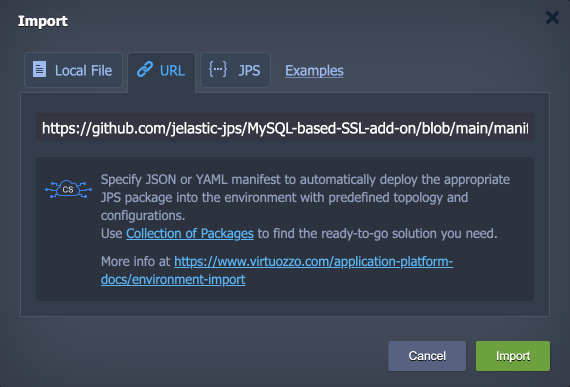

<p align="center">

</p>

# SSL/TLS Encryption in Transit for MySQL/MariaDB/Percona

The add-on automates the SSL/TLS certificate generation and encryption configuration for standalone and cluster MySQL/MariaDB/Percona solutions on the Virtuozzo Application Platform. Get the “**encryption in transit**” security in just a minute, ensuring safe data exchange between server and client.


## Add-On Installation

The add-on can be installed on top of the **MySQL/MariaDB/Percona** and **ProxySQL** (for database clusters) nodes only.

1\. Log into your Virtuozzo Application Platform and import the add-on's manifest from this repository:

```
https://github.com/jelastic-jps/MySQL-based-SSL-add-on/blob/main/manifest.jps
```



2\. Within the opened installation window, select the target **Environment** and **Node Groups** (both database and ProxySQL for clusters) where the add-on will be installed.


Click **Install** to continue.

3\. In a minute, your database will be reconfigured to work over an encrypted connection.


You can find generated SSL certificates under the **/var/lib/jelastic/keys/SSL-TLS** folder and custom settings in the dedicated ***/etc/mysql/conf.d/ssl-config.cnf*** configuration file.


## Add-On Configuration

After the installation, the add-on can be found under the **Add-Ons** tab for the appropriate layer(s). Here, you can generate SSL certificates anew by clicking the **Re-issue certificates** button (e.g. if you think they are compromised or accidentally removed).


To remove the add-on from the layer (including custom configs and generated SSL certificates), expand the menu in the top-right corner of the panel and click **Uninstall**.


## Secure Connection to MySQL/MariaDB/Percona

1\. The “**encryption in transit**” (***server-side encryption***) functionality works immediately after the add-on's installation. You can check it by connecting to the database using the credentials from the email. For remote connection, you can add [endpoint](https://www.virtuozzo.com/application-platform-docs/endpoints/) or [public IP](https://www.virtuozzo.com/application-platform-docs/public-ip/):


Use the following command to connect to the database:

```
mysql --ssl-mode=required -h {host} -P {port} -u {user} -p
```

> **Note:** If you are working with the MariaDB client, replace the “*-\-ssl-mode=required*” option with the “***-\-ssl***” one.

Here:

- ***{user}*** - database username for the connection
- ***{host}*** - database entry point (endpoint, in our case)
- ***{port}*** - port for the connection (from the endpoint, in our case)

Once connected, run the ***status*** command and check for the SSL line in the output.


2\. While connected to the server, you can configure the use of client certificates for authentication to get ***server- and client-side encryption***. Execute the command below to make SSL auth obligatory for the specified user. For example, we’ll provide “***user-2700607***” (replace the ***{user}*** placeholder) from the email received after the environment creation:

```
FLUSH PRIVILEGES;ALTER USER '{user}'@'%' REQUIRE X509;ALTER USER '{user}'@'localhost' REQUIRE X509;FLUSH PRIVILEGES;
```


> **Note:** Common name (CN) is not checked, any certificate signed with this certificate authority (CA) will be considered as appropriate. If you want to check the CN of client certificates (i.e. whether the certificate is issued for the specific user), execute the command below:
> 
> ```
> FLUSH PRIVILEGES;ALTER USER '{user}'@'%' REQUIRE SUBJECT 'CN={user}';ALTER USER '{user}'@'localhost' REQUIRE SUBJECT 'CN={user}';FLUSH PRIVILEGES;
> ```
> 
> Also, if you want to use just certificates for login, you can remove password requirement with the *ALTER USER* command as well.

Now, provide client server (computer/container/VM) with the appropriate SSL certificate files, which can be downloaded from the **/var/lib/jelastic/keys/SSL-TLS/client** directory of the required target node. Once done, you can connect with the following command:

```
mysql –h {host} -P {port} -u {user} -p --ssl-mode=required --ssl-ca={path/to/root.crt} --ssl-cert={path/to/client.crt} --ssl-key={path/to/client.key}
```


> **Tip:** To avoid specifying certificates as arguments, you can add such options to the ***my.cnf*** file on the client server:
> 
> ```
> [client]
> ssl-ca = {path/to/root.crt}
> ssl-cert = {path/to/client.crt}
> ssl-key = {path/to/client.key}
> ```
